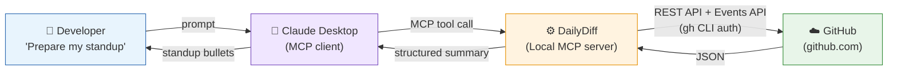

# DailyDiff

> An AI-powered MCP server that automatically surfaces your GitHub activity so you never blank on standup again.

---

## What It Does

DailyDiff is a local [Model Context Protocol (MCP)](https://modelcontextprotocol.io/) server that connects your AI assistant (Claude Desktop) directly to GitHub. Ask it to prepare your standup and it fetches your real commits, pull requests, and branch activity from the last working day — across all your repos, including private org repos and feature branches — and hands them to Claude to generate clean, natural standup bullets.

No copy-pasting. No tab-switching. No forgetting what you did on Friday.

---

## How It Works

```
    Developer --> Claude Desktop --> Standup MCP Server --> GitHub (via gh CLI) --> back
```



The MCP server runs locally on your machine and uses the **GitHub CLI** (`gh`) to query GitHub — no API tokens or secrets in your code, just your existing `gh auth` session.

For specific repos (`owner/repo`), it uses the GitHub REST API and Events API directly, which means it works with **private org repos** and picks up **feature branch** activity. For broader searches it falls back to GitHub's search API.

---

## Prerequisites

| Requirement | Notes |
|---|---|
| [uv](https://docs.astral.sh/uv/) | Fast Python package manager |
| [GitHub CLI](https://cli.github.com/) | Must be installed and authenticated |
| [Claude Desktop](https://claude.ai/download) | Or any MCP-compatible client |

---

## Setup

### 1. Install GitHub CLI & authenticate

Download from https://cli.github.com/, install, then run:

```bash
gh auth login
```

Follow the prompts — select **GitHub.com**, **HTTPS**, and **Login with a web browser**.

---

### 2. Install uv

```bash
# Windows
powershell -ExecutionPolicy ByPass -c "irm https://astral.sh/uv/install.ps1 | iex"

# macOS / Linux
curl -LsSf https://astral.sh/uv/install.sh | sh
```

---

### 3. Configure Claude Desktop

Add the following to your `claude_desktop_config.json`:

**Location:**
| OS | Path |
|---|---|
| Windows | `%APPDATA%\Claude\claude_desktop_config.json` |
| macOS | `~/Library/Application Support/Claude/claude_desktop_config.json` |

Run once:

```bash
uv tool install git+https://github.com/bhismalilly/DailyDiff
```

Then configure:

```json
{
  "mcpServers": {
    "standup-assistant": {
      "command": "dailydiff",
      "env": {
        "GITHUB_USERNAME": "your_github_username",
        "GITHUB_ORG": "your-org"
      }
    }
  }
}
```

Restart Claude Desktop after saving.

---

### Environment Variables

| Variable | Required | Description |
|---|---|---|
| `GITHUB_USERNAME` | No | Your GitHub username. Auto-detected from `gh auth` if omitted. |
| `GITHUB_ORG` | No | Default GitHub org. When set, you can type `my-repo` instead of `your-org/my-repo`. |

These can be set in the MCP config `env` block, in a `.env` file, or as system environment variables.

---

## Usage

Open Claude Desktop and try any of these prompts:

```
Prepare my standup for today.
```

```
What did I work on yesterday?
```

```
Get my standup summary for my-repo.
```

```
Summarize my GitHub activity since 2026-03-28.
```

> With `GITHUB_ORG` set, you can just use the repo name — no need to type `your-org/my-repo` every time.

---

## Tool Reference

### `get_standup_summary`

Fetches commits, pull requests, and branch activity for standup preparation.

| Parameter | Type | Description |
|---|---|---|
| `project` | `string` (optional) | Filter by repo. Use `owner/repo` for exact match, or just the repo name if `GITHUB_ORG` is set. A plain name prefix matches multiple repos. |
| `since_date` | `string` (optional) | ISO date (`YYYY-MM-DD`) to look back from. Defaults to last working day (skips weekends). |

**Returns:**

```json
{
  "since": "2026-03-31",
  "author": "your_github_username",
  "total_commits": 4,
  "repos_with_changes": 2,
  "changes": [
    {
      "repo": "your-org/my-repo",
      "commits": [
        {
          "sha": "1a2b3c4d",
          "message": "Fix null pointer in data pipeline",
          "date": "2026-03-31T14:22:00Z",
          "url": "https://github.com/...",
          "branch": "feat/my-feature"
        }
      ]
    }
  ],
  "pull_requests": [
    {
      "repo": "your-org/my-repo",
      "number": 42,
      "title": "Add retry logic to API client",
      "state": "merged",
      "url": "https://github.com/..."
    }
  ],
  "branch_activity": [
    {
      "type": "branch_created",
      "branch": "feat/my-feature",
      "date": "2026-04-06T06:25:34Z"
    },
    {
      "type": "push",
      "branch": "feat/my-feature",
      "date": "2026-04-06T06:25:35Z",
      "commits": 1
    }
  ],
  "response_format": "# Standup Response Format\n..."
}
```

---

## Architecture

DailyDiff follows a modular design with clear separation of concerns:

| Module | Responsibility |
|---|---|
| `src/dailydiff/server.py` | MCP server initialization and tool registration |
| `src/dailydiff/tools.py` | MCP tool implementations (business logic) |
| `src/dailydiff/github_api.py` | GitHub API interactions (subprocess calls to `gh` CLI) |
| `src/dailydiff/formatters.py` | Response formatting and template loading |

This structure makes it easy to:
- **Add new tools** — define them in `tools.py` and register in `server.py`
- **Modify API logic** — edit `github_api.py` without touching tool definitions
- **Update formats** — change templates in `formatters.py` or `RESPONSE_FORMAT.md`
- **Test independently** — each module can be tested in isolation

---

```
DailyDiff/
├── pyproject.toml                  # Package metadata and dependencies
├── README.md
├── .env.example                    # Config template
└── src/
    └── dailydiff/
        ├── __init__.py
        ├── server.py               # MCP server initialization and routing
        ├── tools.py                # Tool implementations (standup, diffs, etc.)
        ├── github_api.py           # GitHub API interactions via gh CLI
        ├── formatters.py           # Response formatting utilities
        └── RESPONSE_FORMAT.md      # Output formatting rules for standup responses
```

---

## Contributing

Contributions are welcome! If you'd like to improve DailyDiff:

1. Fork the repo
2. Create a feature branch (`git checkout -b feat/your-feature`)
3. Commit your changes (`git commit -m "Add your feature"`)
4. Push to the branch (`git push origin feat/your-feature`)
5. Open a Pull Request

**Ideas for contributions:**
- Support for additional Git platforms (GitLab, Bitbucket)
- Review activity tracking (PRs you reviewed, not just authored)
- Jira/Linear ticket linking from branch names
- Slack integration for posting standups directly
- Customizable response templates
- Caching layer for repeated API calls
- Performance optimizations for large orgs

If you find a bug or have a feature request, please [open an issue](../../issues).

---

## Security

- No GitHub tokens are stored in code or config — authentication is handled entirely by `gh auth`
- The `.env` file should never be committed to version control
- The server runs locally; no data leaves your machine except via the `gh` CLI to GitHub's API
