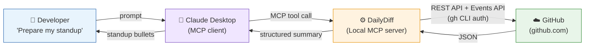

# DailyDiff

> An AI-powered MCP server that automatically surfaces your GitHub activity so you never blank on standup again.

## What It Does

DailyDiff is a local [Model Context Protocol (MCP)](https://modelcontextprotocol.io/) server that connects Claude Desktop directly to GitHub. Ask it to prepare your standup and it fetches your real commits, pull requests, and branch activity from the last working day — across all your repos, including private org repos and feature branches — and hands them to Claude to generate clean, natural standup bullets.

No copy-pasting. No tab-switching. No forgetting what you did on Friday.

## How It Works



The server runs locally and uses the **GitHub CLI** (`gh`) for authentication — no API tokens or secrets in your code, just your existing `gh auth` session.

For specific repos (`owner/repo`), it uses the GitHub REST API and Events API directly, which means it works with **private org repos** and picks up **feature branch** activity. For broader searches it falls back to GitHub's search API.

## Prerequisites

| Requirement | Notes |
|---|---|
| [uv](https://docs.astral.sh/uv/) | Fast Python package manager |
| [GitHub CLI](https://cli.github.com/) | Must be installed and authenticated |
| [Claude Desktop](https://claude.ai/download) | Or any MCP-compatible client |

## Setup

### 1. Install GitHub CLI & authenticate

```bash
gh auth login
```

Follow the prompts — select **GitHub.com**, **HTTPS**, and **Login with a web browser**.

### 2. Install uv

```bash
# Windows
powershell -ExecutionPolicy ByPass -c "irm https://astral.sh/uv/install.ps1 | iex"

# macOS / Linux
curl -LsSf https://astral.sh/uv/install.sh | sh
```

### 3. Install DailyDiff

```bash
uv tool install git+https://github.com/bhismalilly/DailyDiff
```

### 4. Configure Claude Desktop

Open your `claude_desktop_config.json`:

> **Windows:** `Ctrl ,` → **Developer** → **Edit Config**
>
> **macOS:** `⌘ ,` → **Developer** → **Edit Config**

Add this to the file:

```json
{
  "mcpServers": {
    "standup-assistant": {
      "command": "dailydiff",
      "env": {
        "GITHUB_USERNAME": "your_github_username",
        "GITHUB_ORG": "your-org"
      }
    }
  }
}
```

Restart Claude Desktop after saving.

> **Note:** Both variables are optional. `GITHUB_USERNAME` is auto-detected from `gh auth` if omitted. `GITHUB_ORG` lets you type `my-repo` instead of `your-org/my-repo`.

## Usage

Open Claude Desktop and try:

- `Prepare my standup for today.`
- `What did I work on yesterday?`
- `Get my standup summary for my-repo.`
- `Summarize my GitHub activity since last Monday.`

> With `GITHUB_ORG` set, you can just use the repo name — no need to type `your-org/my-repo` every time.

## Architecture

```
DailyDiff/
├── pyproject.toml                  # Package metadata and dependencies
├── README.md
└── src/
    └── dailydiff/
        ├── __init__.py
        ├── server.py               # MCP server initialization and routing
        ├── tools.py                # Tool implementations (standup, diffs, etc.)
        ├── github_api.py           # GitHub API interactions via gh CLI
        ├── formatters.py           # Response formatting utilities
        └── RESPONSE_FORMAT.md      # Output formatting rules for standup responses
```

## Security

- No GitHub tokens stored in code or config — authentication is handled entirely by `gh auth`
- The server runs locally; no data leaves your machine except via the `gh` CLI to GitHub's API
