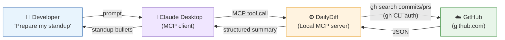

# DailyDiff

> An AI-powered MCP server that automatically surfaces your GitHub activity so you never blank on standup again.

---

## What It Does

DailyDiff is a local [Model Context Protocol (MCP)](https://modelcontextprotocol.io/) server that connects your AI assistant (Claude Desktop) directly to GitHub. Ask it to prepare your standup and it fetches your real commits and pull requests from the last working day — across all your repos — and hands them to Claude to generate clean, natural standup bullets.

No copy-pasting. No tab-switching. No forgetting what you did on Friday.

---

## How It Works

```
    Developer --> Claude Desktop --> Standup MCP Server --> GitHub (via gh CLI) --> back
```



The MCP server runs locally on your machine and uses the **GitHub CLI** (`gh`) to query GitHub — no API tokens or secrets in your code, just your existing `gh auth` session.

---

## Prerequisites

| Requirement | Notes |
|---|---|
| Python 3.11+ | |
| [GitHub CLI](https://cli.github.com/) | Must be installed and authenticated |
| [Claude Desktop](https://claude.ai/download) | Or any MCP-compatible client |

---

## Setup

### 1. Install GitHub CLI & authenticate

Download from https://cli.github.com/, install, then run:

```bash
gh auth login
```

Follow the prompts — select **GitHub.com**, **HTTPS**, and **Login with a web browser**.

---

### 2. Install Python dependencies

```bash
pip install -r requirements.txt
```

---

### 3. Configure environment

Copy `.env.example` to `.env` and fill in your GitHub username:

```bash
cp .env.example .env
```

```env
GITHUB_USERNAME=your_github_username
```

> If `GITHUB_USERNAME` is omitted, it will be auto-detected from your `gh auth` session.

---

### 4. Configure Claude Desktop

Add the following to your `claude_desktop_config.json`:

**Location:** `%APPDATA%\Claude\claude_desktop_config.json`

```json
{
  "mcpServers": {
    "standup-assistant": {
      "command": "python",
      "args": ["C:\\path\\to\\DailyDiff\\server.py"],
      "env": {
        "GITHUB_USERNAME": "your_github_username"
      }
    }
  }
}
```

Restart Claude Desktop after saving.

---

## Usage

Open Claude Desktop and try any of these prompts:

```
Prepare my standup for today.
```

```
What did I work on yesterday?
```

```
Get my standup summary for the EliLillyCo/my-repo repo.
```

```
Summarize my GitHub activity since 2026-03-28.
```

---

## Tool Reference

### `get_standup_summary`

Fetches commits and pull requests for standup preparation.

| Parameter | Type | Description |
|---|---|---|
| `project` | `string` (optional) | Filter by repo. Use `owner/repo` for exact match, or a name prefix to match multiple repos. |
| `since_date` | `string` (optional) | ISO date (`YYYY-MM-DD`) to look back from. Defaults to last working day (skips weekends). |

**Returns:**

```json
{
  "since": "2026-03-31",
  "author": "bhismalilly",
  "total_commits": 4,
  "repos_with_changes": 2,
  "changes": [
    {
      "repo": "EliLillyCo/my-repo",
      "commits": [
        {
          "sha": "1a2b3c4d",
          "message": "Fix null pointer in data pipeline",
          "date": "2026-03-31T14:22:00Z",
          "url": "https://github.com/..."
        }
      ]
    }
  ],
  "pull_requests": [
    {
      "repo": "EliLillyCo/my-repo",
      "number": 42,
      "title": "Add retry logic to API client",
      "state": "merged",
      "url": "https://github.com/..."
    }
  ]
}
```

---

## Project Structure

```
DailyDiff/
├── server.py          # MCP server — tool definitions and gh CLI logic
├── requirements.txt   # Python dependencies
├── .env               # Your local config (not committed)
└── .env.example       # Config template
```

---

## Security Notes

- No GitHub tokens are stored in code or config — authentication is handled entirely by `gh auth`
- The `.env` file should never be committed to version control
- The server runs locally; no data leaves your machine except via the `gh` CLI to GitHub's API
